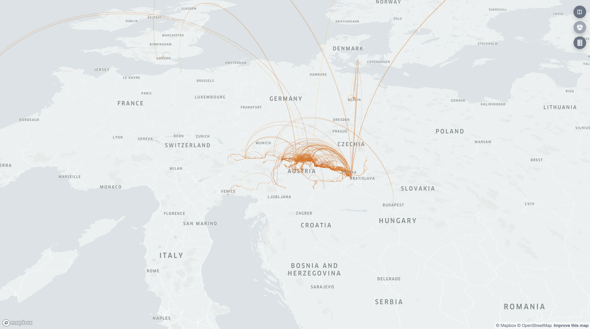
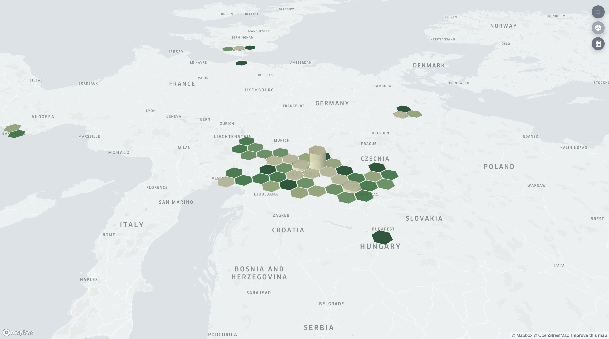

# kepler-timeline
_display information from google's Location history in a beautiful kepler-gl map_

## How to get this running in a simple way:
- Check this repository locally and open the `kepler-timeline.ipynb` notebook in jupyter.
- Follow the instructions in the notebook to download and unzip your location history from [google takeout](takeout.google.com)
- create and save awesome, interactive maps!

## What it looks like
**Map with arcs for every trip**

**Hexbins for location visits**

## Dependencies
- [kepler.gl](https://kepler.gl)
- [maps-timeline by nubenum](https://github.com/nubenum/maps-timeline)
